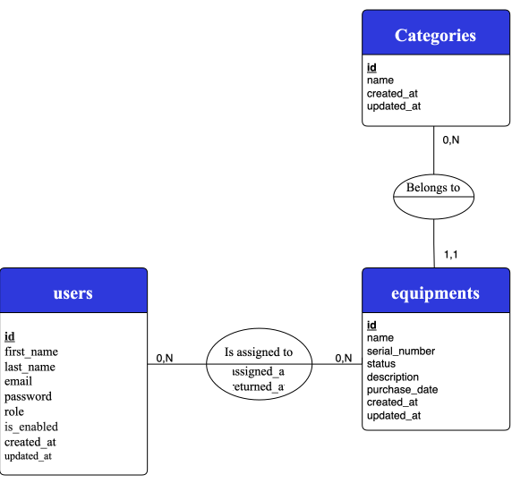

# EquipCore API

<div align="center">


</div>

## Overview

**EquipCore API** is an **IT equipment management REST API** designed to help organizations **tracking equipment, categories, assignments, and returns, with role-based access control**.

## Table of Contents

- [Problem](#problem)
- [Solution](#solution)
- [Core Features](#core-features)
- [Tech Stack](#tech-stack)
- [Architecture](#architecture)
- [Data Model and Persistence](#data-model-and-persistence)
- [Security](#security)
- [Validation and Error Handling](#validation-and-error-handling)
- [Testing](#testing)
- [Environments](#environments)
- [CI Pipeline](#ci-pipeline)
- [Getting Started](#getting-started)

## Problem

Organizations may face several challenges when managing IT equipment :

* **Limited visibility** into available and assigned equipment.
* **Difficulty tracking equipment ownership**, making it harder to know which employee is responsible for a specific piece of equipment.
* **Manual assignment and return processes**, which can lead to inconsistencies.
* **Scattered equipment information and inconsistent categorization**, making management and retrieval more difficult.

## Solution

EquipCore API provides a **centralized equipment management system** that allows organizations to :

* **Manage equipment** and track its current availability.
* **Organize equipment into categories** that can be managed according to organizational needs.
* **Assign equipment to employees** and record equipment returns.
* **Control access by role** so that each user can only perform the operations corresponding to their responsibilities.
* **Keep assignment records** to maintain a consistent record of equipment allocation and return.

## Core Features

The application provides a set of **core features**, with access and available actions determined by the user's **role**. 

The following table summarizes the features available to each role :

| Role | Features |
|---   |---             |
| **ADMIN** | Manage users, equipment, categories, assignments/returns and view all records |
| **TECHNICIAN** | Manage equipment, categories, assignments/returns and view all records |
| **EMPLOYEE** | View own profile, update own info, view equipment assigned to them |

>For details on **each feature**, see [`features`](docs/features).

## Tech Stack

<div align="center">


</div>

<br/>

- **Language / Framework :** Java 21, Spring Boot 4.1.1
- **Security :** Spring Security, JWT
- **Database and Persistence :** Spring Data JPA, PostgreSQL, H2
- **Database Migrations :** Flyway
- **Validation :** Jakarta Bean Validation
- **Testing :** JUnit 5, MockMvc, Mockito
- **Containerization :** Docker
- **CI/CD :** Github Action
- **Code Quality :** SonarQube Cloud
- **Build Tool :** Maven (wrapper 3.3.4)
- **Version Control :** Git & GitHub

## Architecture

The backend follows a **layered architecture with a clean separation of responsibilities**.

The application is organized into **dedicated layers** for : `HTTP handling`, `business logic`, `data access`, `data mapping`, `validation`, `security`, and `exception handling`.

### Project Structure

>_Project structure will be documented once all planned features are finalized._


## Data Model and Persistence

The system is built around **three core entities :** `users`, `equipments`, and `categories`.



>For details on **entities, associations, and the Flyway migration strategy**, see [`data-model-and-persistence`](docs/database/data-model-and-persistence.md).

## Security

Security is addressed through three complementary mechanisms :

- **Authentication :** JSON Web Tokens (JWT), no server-side session.
- **Authorization :** role-based access control (RBAC).
- **Password encoding :** passwords are never stored in plain text.

> For details on **filter chain, JWT processing, etc.**, see [`security`](docs/security/).

## Validation and Error Handling

Validation is handled with `Jakarta Bean Validation`, complemented by `dedicated validation services` for rules that can't be expressed with annotations alone.

Error handling relies on a `single global exception handler` that catches both **system exceptions and custom exceptions**, mapping all of them to a **consistent error response**.

**Custom exceptions** are grouped into `base classes by HTTP status` (a shared base for every **409 Conflict**, another for every **422 Unprocessable Content**, and so on) rather than one exception per business rule.

Every `error response` follows the same structure :

* `Status code`
* `Message`
* `Error code` identifying the exact cause

### Example :

A **duplicate category name** and a **duplicate user email**, each raise a **distinct exception**, but both **extend the same 409 base**, so the global handler only **needs one handler per status-code family**, not one per rule.

## Testing

Each developed feature is **covered by two complementary testing levels :**

- `Unit tests :` validate **business logic** in the service layer in isolation with **JUnit 5 and Mockito**.
- `Request-to-response tests :` validate a **complete endpoint's flow**, from the incoming HTTP request to the returned response with **MockMvc**.

## Environments

The application is **configured** with `three Spring profiles`, each providing a dedicated configuration for a specific environment :

| Profile | Purpose | Database |
|---|---|---|
| `dev` | Local development | PostgreSQL |
| `test` | Automated tests, isolated from the main database | H2 (in-memory) |
| `docker` | Containerized run via Docker Compose | PostgreSQL |

Configuration is **externalized through environment variables never hardcoded :**

* For `Docker`, values are supplied via the `.env file`.
* For `local development`, they are set through the `IDE run configuration`.

`.env.example` serves as a **template** documenting the **required environment variables**, while actual `.env` files remain **excluded from version control**.

## CI Pipeline

**Continuous Integration** is handled through **GitHub Actions** and structured around **four stages :**

1. `Build :` Compiles the code.
2. `Test :` Runs the automated tests.
3. `Code Quality :` Performs static analysis with **SonarQube** and waits for the **Quality Gate**.
4. `Package and Containerize:` Packages the application and builds and pushes a tagged Docker image to **GitHub Container Registry (GHCR)**.

```text
Git Push
   ↓
GitHub Actions
   ↓
Checkout
   ↓
Build
   ↓
Run tests
   ↓
Code quality (SonarQube + Quality Gate)
   ↓
Package and Docker build
   ↓
Push Docker image to GHCR (main only)
```

* The **workflow** is triggered by `every push`, as well as by `pull requests` targeting `main` or `develop`.
* `Build, test, and code quality` run on `every branch`, ensuring that **changes** are **validated consistently**.
* `Package and Docker Build` only run on `main`.
* The `Docker image` is tagged using the **Git commit SHA** and pushed to `GHCR`.

> The workflow configuration is defined in [`equipecore-ci.yml`](.github/workflows/equipcore-ci.yml).

## Getting Started

### Prerequisites
- JDK 21 (For the local option)
- Docker and Docker Compose (for the Docker option)
- Clone the repository
```bash
   git clone https://github.com/Asteriix00/equipcore-api.git
   cd equipcore-api
```

### Option 01 : Run with Docker

1. Copy `.env.example` to `.env` and fill in the required values
```bash
   cp .env.example .env
```
2. Start the application
```bash
   docker compose up -d
```

The API will be available with the `docker profile active`, backed by a containerized `PostgreSQL instance`.

### Option 02 : Run locally (IDE)

1. Set the `required environment variables` in your `IDE's run configuration` (matching what's expected in `application.yaml` / `application-dev.yaml`)
2. Run the application with the `dev profile active`

This uses a `local PostgreSQL instance` instead of the Docker managed one.